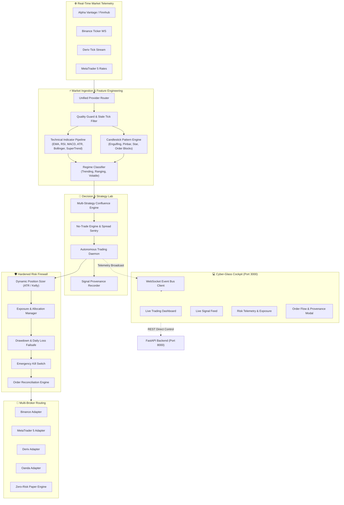

<div align="center">

# ⚡ VALEXIS QUANT MATRIX ⚡
### *Next-Generation Autonomous Quantitative Trading Engine & High-Frequency Telemetry Cockpit*

[](https://github.com/vivekmarathe2004/trader-)
[](https://www.python.org/)
[](https://fastapi.tiangolo.com/)
[](https://nextjs.org/)
[](https://www.typescriptlang.org/)
[](https://tailwindcss.com/)
[](https://opensource.org/licenses/MIT)

<br/>

```
  ██▒   █▓ ▄▄▄       ██▓    ▓█████ ▒██   ██▒ ██▓  ██████ 
 ▓██░   █▒▒████▄    ▓██▒    ▓█   ▀ ▒▒ █ █ ▒░▓██▒▒██    ▒ 
  ▓██  █▒░▒██  ▀█▄  ▒██░    ▒███   ░░  █   ░▒██▒░ ▓██▄   
   ▒██ █░░░██▄▄▄▄██ ▒██░    ▒▓█  ▄  ░ █ █ ▒ ░██░  ▒   ██▒
    ▒▀█░   ▓█   ▓██▒░██████▒░▒████▒▒██▒ ▒██▒░██░▒██████▒▒
    ░ ▐░   ▒▒   ▓▒█░░ ▒░▓  ░░░ ▒░ ░▒▒ ░ ░▓ ░░▓  ▒ ▒▓▒ ▒ ░
    ░ ░░    ▒   ▒▒ ░░ ░ ▒  ░ ░ ░  ░░░   ░▒ ░ ▒ ░░ ░▒  ░ ░
      ░░    ░   ▒     ░ ░      ░    ░    ░   ▒ ░░  ░  ░  
       ░        ░  ░    ░  ░   ░  ░ ░    ░   ░        ░  
      ░                                                  
```

**VALEXIS QUANT** is a production-ready, institutional-grade quantitative trading platform featuring deterministic strategy confluence engines, unbypassable multi-tiered risk guardrails, multi-broker execution routing, and a real-time dark glassmorphic command cockpit.

[Key Architecture](#-core-architecture) • [Linux Setup Guide](#-linux-deployment--running-guide) • [Windows & macOS Setup](#-windows--macos-quick-start) • [Execution Matrix](#-multi-broker-execution-matrix) • [REST API Reference](#-rest-api--telemetry-endpoints) • [Quant Strategy Lab](#-quantitative-strategy-suite)

---

</div>

<br/>

## 📑 Table of Contents
1. [System Overview & Highlights](#-system-overview--highlights)
2. [Core Architecture](#-core-architecture)
3. [Linux Deployment & Running Guide](#-linux-deployment--running-guide)
   - [Prerequisites Installation](#1-prerequisites-installation-ubuntudebianarchfedora)
   - [Clone & Environment Setup](#2-clone--configure-environment)
   - [Automated Bash Startup](#3-one-command-linux-startup)
   - [Manual Step-by-Step Execution](#4-manual-step-by-step-linux-execution)
   - [Running Headless with Systemd / Screen / Tmux](#5-production-headless-daemon-systemd--tmux)
4. [Windows & macOS Quick Start](#-windows--macos-quick-start)
5. [Multi-Broker Execution Matrix](#-multi-broker-execution-matrix)
6. [Hardened Risk & Safety Architecture](#-hardened-risk--safety-architecture)
7. [Quantitative Strategy Suite](#-quantitative-strategy-suite)
8. [REST API & Telemetry Endpoints](#-rest-api--telemetry-endpoints)
9. [Configuration Dictionary (.env Reference)](#-configuration-dictionary-env-reference)
10. [Testing & Verification](#-testing--verification)
11. [Troubleshooting & FAQ](#-troubleshooting--faq)
12. [Disclaimer & License](#-disclaimer--license)

---

## 💎 System Overview & Highlights

<table>
  <tr>
    <td width="50%">
      <h3>🎯 Deterministic Confluence Engine</h3>
      <ul>
        <li>Multi-timeframe price action & quantitative indicator analysis.</li>
        <li>Dynamic pattern engine: Pinbar, Engulfing, Morning/Evening Star, Order Blocks.</li>
        <li>Automatic market regime classification: Trending, Ranging, Mean Reverting, and High Volatility.</li>
        <li>Immutable decision provenance trail recorded for every tick and signal.</li>
      </ul>
    </td>
    <td width="50%">
      <h3>🛡️ Zero-Bypass Risk Firewall</h3>
      <ul>
        <li>Dynamic ATR, Fixed-Fractional, and Kelly Criterion position sizing.</li>
        <li>Automated portfolio drawdown circuit breakers & daily loss killswitches.</li>
        <li>Order state machine reconciliation with active broker position auditing.</li>
        <li>No-Trade filters protecting against spread spikes, illiquid hours, and news.</li>
      </ul>
    </td>
  </tr>
  <tr>
    <td width="50%">
      <h3>🔌 Universal Broker Matrix</h3>
      <ul>
        <li><b>Binance:</b> Spot & USDⓈ-M Futures (REST + WebSocket).</li>
        <li><b>MetaTrader 5 (MT5):</b> Direct IPC execution for FX, Indices & CFDs.</li>
        <li><b>Deriv:</b> Low-latency WebSocket synthetic & forex execution.</li>
        <li><b>OANDA:</b> Institutional v20 REST API execution.</li>
        <li><b>Paper Trading:</b> Realistic slippage & order queue simulation.</li>
      </ul>
    </td>
    <td width="50%">
      <h3>⚡ Next.js 14 Cyber Cockpit</h3>
      <ul>
        <li>Real-time WebSocket streaming with sub-second health heartbeats.</li>
        <li>Glassmorphic cyber-aesthetic with live pulse animations.</li>
        <li>Interactive Signal Provenance explorer and Order Flow modals.</li>
        <li>One-click Emergency Panic Liquidator & AutoTrader toggle switch.</li>
      </ul>
    </td>
  </tr>
</table>

---

## 🏛️ Core Architecture



---

## 🐧 Linux Deployment & Running Guide

VALEXIS QUANT is engineered for optimal performance on Linux distributions (**Ubuntu, Debian, Arch Linux, Fedora, RHEL, CentOS**), as well as headless cloud VPS instances (AWS EC2, DigitalOcean, Linode, Hetzner).

### 1. Prerequisites Installation (Ubuntu/Debian/Arch/Fedora)

#### Ubuntu / Debian / Linux Mint:
```bash
sudo apt update && sudo apt install -y python3 python3-pip python3-venv nodejs npm git curl lsof
```

#### Arch Linux / Manjaro:
```bash
sudo pacman -Syu python python-pip nodejs npm git curl lsof
```

#### Fedora / RHEL / Rocky Linux:
```bash
sudo dnf install -y python3 python3-pip nodejs npm git curl lsof
```

*(Ensure Node.js is version >= 18.x and Python >= 3.10)*
```bash
node -v   # Should output v18.x or higher
python3 -V # Should output Python 3.10.x or higher
```

---

### 2. Clone & Configure Environment

```bash
# 1. Clone repository
git clone https://github.com/vivekmarathe2004/trader-.git
cd trader-

# 2. Setup Environment Configuration
cp .env.example .env

# 3. Edit environment with your preferred editor (nano / vim)
nano .env
```

---

### 3. One-Command Linux Startup

Run both backend and frontend concurrently in terminal with automatic port checking:

```bash
# Terminal 1: Backend Daemon
cd backend
python3 -m venv .venv
source .venv/bin/activate
pip install -r requirements.txt
python3 -m uvicorn app.main:app --reload --host 0.0.0.0 --port 8000
```

```bash
# Terminal 2: Frontend Cockpit
cd frontend
npm install
npm run dev -- --host 0.0.0.0 --port 3000
```

---

### 4. Manual Step-by-Step Linux Execution

#### Step A: Backend Initialization
```bash
cd backend

# Create isolated Python virtual environment
python3 -m venv .venv

# Activate environment
source .venv/bin/activate

# Upgrade pip & install dependencies
pip install --upgrade pip
pip install -r requirements.txt

# Run database migrations (SQLite initializes automatically)
python3 -m uvicorn app.main:app --host 0.0.0.0 --port 8000 --reload
```
*Backend Swagger API documentation is now live at `http://localhost:8000/docs`.*

#### Step B: Frontend Initialization
```bash
# In a new terminal window or tab
cd frontend

# Install UI dependencies
npm install

# Start Next.js Development Server
npm run dev
```
*Frontend Cyber Cockpit is now live at `http://localhost:3000`.*

---

### 5. Production Headless Daemon (Systemd / Tmux)

For 24/7 autonomous VPS deployments without an open GUI session:

#### Option A: Running with Tmux / Screen
```bash
# Install tmux
sudo apt install -y tmux

# Start a detached session
tmux new -s valexis

# Run Backend
cd /path/to/trader-/backend
source .venv/bin/activate
python3 -m uvicorn app.main:app --host 0.0.0.0 --port 8000

# Detach from session: Press Ctrl+B then D
# Re-attach anytime:
tmux attach -t valexis
```

#### Option B: Production Systemd Service Unit
Create a system service `/etc/systemd/system/valexis-backend.service`:
```ini
[Unit]
Description=Valexis Quant Autonomous Backend Service
After=network.target

[Service]
Type=simple
User=ubuntu
WorkingDirectory=/home/ubuntu/trader-/backend
ExecStart=/home/ubuntu/trader-/backend/.venv/bin/uvicorn app.main:app --host 0.0.0.0 --port 8000
Restart=always
RestartSec=5
EnvironmentFile=/home/ubuntu/trader-/.env

[Install]
WantedBy=multi-user.target
```

Enable and start the service:
```bash
sudo systemctl daemon-reload
sudo systemctl enable valexis-backend
sudo systemctl start valexis-backend
sudo systemctl status valexis-backend
```

---

## 🪟 Windows & macOS Quick Start

### Windows (Single Window Console)
1. **Double-click `Start-Platform.cmd`** or run PowerShell:
```powershell
.\start.ps1
```
2. The unified script releases lingering processes, boots the FastAPI background server, confirms `/api/v1/health`, and spins up the Next.js cockpit.

### macOS (Terminal)
```bash
# Install dependencies via Homebrew
brew install python@3.11 node git

# Launch Backend
cd backend && python3 -m venv .venv && source .venv/bin/activate && pip install -r requirements.txt
python3 -m uvicorn app.main:app --reload --port 8000

# Launch Frontend (in another tab)
cd frontend && npm install && npm run dev
```

---

## 🔌 Multi-Broker Execution Matrix

VALEXIS QUANT abstracts broker communication behind a unified, polymorphic broker interface:

| Broker | Market Coverage | Protocol / Transport | Features & Execution Type |
| :--- | :--- | :--- | :--- |
| **Binance** | Crypto (Spot / USDⓈ-M Futures) | REST API & Live WS | Limit, Market, Stop-Loss, Take-Profit, Trailing Stops |
| **MetaTrader 5** | Forex, Indices, Commodities | Native IPC (Zero Latency) | Full tick-by-tick order placement, SL/TP server-side sync |
| **Deriv** | Synthetic Volatility, Forex | Secure WebSocket API | Fixed & dynamic tick contracts, CFD margin trading |
| **OANDA** | Spot FX, CFDs, Precious Metals | v20 High-Speed REST | Sub-pip fractional execution, streaming pricing |
| **Mock Paper Engine**| All Supported Assets | In-Memory Simulation | Zero-risk testing with realistic latency & slippage models |

---

## 🛡️ Hardened Risk & Safety Architecture

```
[ INCOMING SIGNAL ]
         │
         ▼
┌────────────────────────────────────────┐
│  1. SPREAD & LIQUIDITY SENTINEL        │  ──► REJECT IF Spread > Max Allowed or Market Closed
└────────────────────────────────────────┘
         │ (PASS)
         ▼
┌────────────────────────────────────────┐
│  2. DRAWDOWN & CIRCUIT BREAKER         │  ──► REJECT IF Daily Loss > Threshold or Drawdown Limit
└────────────────────────────────────────┘
         │ (PASS)
         ▼
┌────────────────────────────────────────┐
│  3. DYNAMIC POSITION SIZING (ATR/Kelly)│  ──► Computes precise lot size based on equity risk %
└────────────────────────────────────────┘
         │ (PASS)
         ▼
┌────────────────────────────────────────┐
│  4. PORTFOLIO EXPOSURE AUDITOR         │  ──► REJECT IF Max Concurrent Positions Exceeded
└────────────────────────────────────────┘
         │ (PASS)
         ▼
┌────────────────────────────────────────┐
│  5. LIVE MASTER GATE & EMERGENCY LOCK  │  ──► REJECT IF Kill Switch Active or Live Gate Disabled
└────────────────────────────────────────┘
         │ (PASS)
         ▼
[ DISPATCH TO BROKER MATRIX ]
```

---

## 📊 Quantitative Strategy Suite

VALEXIS QUANT features built-in algorithmic strategies that run standalone or combined in the **Confluence Lab**:

1. **Trend Momentum Cascade (SuperTrend + EMA Ribbon)**:
   - Identifies structural trend direction via 200 EMA & 50 EMA slope.
   - Triggers precision entries on SuperTrend momentum flips with dynamic ATR trailing stops.
2. **Mean Reversion Envelope (Bollinger Bands + RSI Extremes)**:
   - Detects overextended price deviations outside 2.5σ Bollinger Bands coupled with RSI divergences (< 25 or > 75).
3. **Institutional Candlestick Breakout**:
   - Algorithmic detection of Fair Value Gaps (FVG), Bullish/Bearish Engulfing candles, and Order Blocks.
4. **Volatility Squeeze Engine (Keltner Channels + Bollinger Band Width)**:
   - Identifies explosive volatility contraction phases and enters on dynamic breakout volume expansion.

---

## 📡 REST API & Telemetry Endpoints

The FastAPI backend exposes 40+ REST endpoints and WebSocket event streams:

### Core Endpoints

| Method | Endpoint | Description |
| :--- | :--- | :--- |
| `GET` | `/api/v1/health` | Comprehensive system health, uptime, and broker status |
| `GET` | `/api/v1/config` | Global platform configuration and symbols matrix |
| `GET` | `/api/v1/signals` | Live generated quantitative trading signals |
| `POST`| `/api/v1/autotrader/start` | Engage autonomous scanning and trade execution |
| `POST`| `/api/v1/autotrader/stop` | Stand down autonomous scanner to standby mode |
| `GET` | `/api/v1/positions` | Active open positions across all connected venues |
| `POST`| `/api/v1/positions/close-all` | Emergency panic liquidator (closes all positions) |
| `POST`| `/api/v1/risk/kill-switch` | Toggle global emergency risk kill switch |
| `POST`| `/api/v1/backtest/run` | Execute high-speed event-driven strategy backtest |
| `POST`| `/api/v1/backtest/monte-carlo`| Run Monte Carlo simulation and drawdown stress test |
| `GET` | `/api/v1/logs` | Real-time audit logs with IST timestamps |
| `WS`  | `/ws/events` | High-frequency telemetry WebSocket event stream |

---

## ⚙️ Configuration Dictionary (.env Reference)

```env
# ==============================================================================
# ENVIRONMENT & SECURITY
# ==============================================================================
APP_ENV=development                       # 'development' or 'production'
SECRET_KEY=replace-with-secure-32-byte-key # Used for credential encryption

# ==============================================================================
# MASTER SAFETY GATES
# ==============================================================================
LIVE_TRADING_ENABLED=false                # Master safety switch: false = Simulation/Paper
AUTOTRADER_AUTOSTART_ON_BOOT=false        # Start AutoTrader daemon immediately on startup

# ==============================================================================
# RISK ENGINE THRESHOLDS
# ==============================================================================
MAX_DAILY_DRAWDOWN_PERCENT=3.0            # Halt trading if daily loss reaches 3%
MAX_TOTAL_DRAWDOWN_PERCENT=6.0            # Emergency lock if total drawdown reaches 6%
MAX_OPEN_POSITIONS=5                      # Max concurrent open trades across all pairs
RISK_PER_TRADE_PERCENT=1.0                # Max risk allocated per single position

# ==============================================================================
# BROKER CREDENTIALS (Optional for Mock/Paper Mode)
# ==============================================================================
BINANCE_API_KEY=                          # Binance API Key
BINANCE_API_SECRET=                       # Binance API Secret
DERIV_API_TOKEN=                          # Deriv WebSocket Token
DERIV_APP_ID=1089                         # Deriv App ID
OANDA_API_KEY=                            # Oanda v20 Personal Access Token
OANDA_ACCOUNT_ID=                         # Oanda Account Number

# ==============================================================================
# MARKET DATA PROVIDERS
# ==============================================================================
ALPHA_VANTAGE_API_KEY=                    # Alpha Vantage API Key
FINNHUB_API_KEY=                          # Finnhub Stock/Forex API Key
```

---

## 🧪 Testing & Verification

Run the automated test suite covering unit tests, risk controls, and broker mocks:

```bash
cd backend

# Run all unit and integration tests
pytest -v

# Run with code coverage report
pytest --cov=app tests/
```

---

## ❓ Troubleshooting & FAQ

<details>
<summary><b>Q: How do I resolve "Address already in use" on port 8000 or 3000?</b></summary>
<br/>
On Linux / macOS:
```bash
sudo lsof -ti tcp:8000 | xargs kill -9
sudo lsof -ti tcp:3000 | xargs kill -9
```
On Windows PowerShell:
```powershell
Get-NetTCPConnection -LocalPort 8000,3000 | ForEach-Object { Stop-Process -Id $_.OwningProcess -Force }
```
</details>

<details>
<summary><b>Q: Can I run this safely without any real broker accounts?</b></summary>
<br/>
<b>Yes!</b> By default, <code>LIVE_TRADING_ENABLED=false</code> and the platform defaults to the built-in <b>Mock Broker</b>. You can test strategies, view signals, and execute full paper trades with zero risk to real funds.
</details>

<details>
<summary><b>Q: How do I run MetaTrader 5 on Linux?</b></summary>
<br/>
MetaTrader 5 Python IPC requires Windows or a Wine-based wrapper (e.g. <code>wine-gecko</code> with Python for Windows inside Wine). Alternatively, use the <b>Binance</b>, <b>Deriv</b>, or <b>Oanda</b> broker modules which run natively on pure Linux without any emulation.
</details>

---

## ⚠️ Disclaimer & License

> **IMPORTANT RISK DISCLOSURE:**
> Algorithmic and quantitative trading carries a substantial level of risk of financial loss. Past backtested performance is no guarantee of future live performance. The software and materials in this repository are provided strictly for educational, scientific, and research purposes. Always verify strategies with paper trading before deploying real capital.

Distributed under the **MIT License**. See `LICENSE` for more information.

<div align="center">

---
<sub>Crafted for algorithmic traders and quantitative researchers. Built with FastAPI & Next.js.</sub>

</div>
